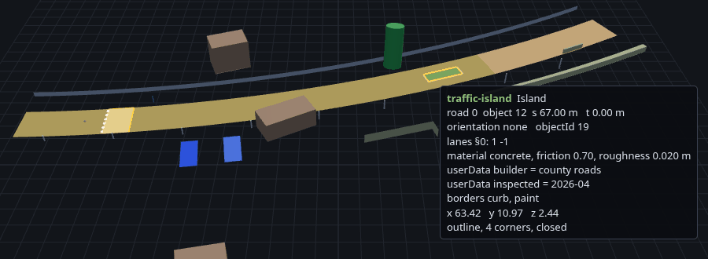

# libopendrive

A pure-Rust OpenDRIVE (`.xodr`) importer. Reads a map file and bakes it into a
road network of polyline lanes, a drive-direction lane graph, and a triangle
surface mesh.

No C++ dependency, no bindings, no `unsafe`.

```rust
use libopendrive::{load_file, Point};

let net = load_file("maps/town07.xodr")?;

// Where is the road under this point, and which way does it lean?
let sample = net.sample_near(Point::new(12.0, -30.0, 0.0)).expect("on the map");
println!("{:?} banked {} rad", sample.point, sample.bank);

// Drive somewhere.
let waypoints = net.route(sample.point, Point::new(280.0, 95.0, 0.0));

// Hand the surface to a collider or a renderer.
let mesh = net.surface_mesh();
mesh.validate()?;
```

## Which OpenDRIVE version

The importer never reads `<header>`, so it never inspects `revMajor` or
`revMinor` and never rejects a file for its declared version. Whether a file
loads depends only on whether it uses the elements listed below, not on the
revision it declares.

Every one of those elements is in ASAM OpenDRIVE 1.9.0, the current revision.
`poly3` is deprecated there in favor of `paramPoly3`, but the importer reads
it the same as any current element and prints no warning for using it. The
test suite imports real files declaring 1.4, 1.6 and 1.7.

## What it imports

- Reference geometry: `line`, `arc`, `spiral` (clothoid), `paramPoly3`,
  `poly3`.
- `<elevationProfile>`, and `<lateralProfile>` superelevation baked as a real
  cant. The cross-section rolls about the reference line, so an outer lane
  rides higher and its surface normal leans.
- Per-lane widths, `laneOffset`, and multiple lane sections.
- The whole lane cross-section, the carriageway included. `LaneType` names
  every function the format defines, among them sidewalks, kerbs, ramps and
  tram track, and an unrecognised name bakes as `LaneType::Unknown` rather
  than leaving a hole. `LaneType::is_drivable` separates the ones traffic
  uses.
- Lane widths that vary along a lane, so a gore area that opens out of a
  point is drawn as the wedge it is.
- Road/lane `<link>`s and `<junction>`s, resolved into a drive-direction lane
  graph.
- `<object>`s, from `RoadNetwork::objects`, in world coordinates on the road
  surface.
  - A plain object is a box or a cylinder with a heading, pitch and roll.
    It leans with the grade and bank of the road under it, as in
    libOpenDRIVE.
  - A `<repeat>` with a `distance` becomes one object per step, so a row of
    posts arrives as posts. A `<repeat>` with a `distance` of 0, such as a
    guard rail, becomes one shape swept along the road. With a radius it is
    a round pipe.
  - An `<outline>`, in road or local coordinates, becomes a footprint polygon
    with a height at every corner. An `outer="false"` outline is a hole cut
    out of the outline round it.
  - An `<objectReference>` places the object it names again, at the
    reference's own station.
  - A `<marking>`, such as a crosswalk's stripes, becomes painted quads along
    the outline edges it names, or along one side of the object's box if it
    names none. A `<border>`, such as a kerb, becomes a band along outline
    edges.
  - `<validity>` picks the lanes an object applies to.
  - `<parkingSpace>`, `<material>` and `<userData>` are kept on the object as
    data.

  Each object has an id to look it up by, a subtype, and whether it moves.
  `load_*_with_provenance` gives its road, OpenDRIVE id, `(s, t)`,
  orientation and valid length, as it does a lane's road and id.
- `<tunnel>`s and `<bridge>`s, from `RoadNetwork::structures`, as the stretch
  of each lane they cover. Call `structures_over(lane)` to find out whether a
  lane runs through a tunnel or over a bridge, and where.

For the exact element and attribute list, see
[the crate docs](https://docs.rs/libopendrive).

Geometry is cross-checked against the reference C++
[libOpenDRIVE](https://github.com/pageldev/libOpenDRIVE).

## What it ignores

Everything else in the file, silently, including `<signals>`, `<roadMark>`,
and `<geoReference>`. Three omissions change the road you get back, not only
the detail around it:

- `<shape>`, the other lateralProfile child, so a crowned or cambered
  cross-section imports flat across its width.
- A lane's `<border>`, as opposed to an object's. A lane whose extent comes
  from a border rather than a width element has nothing to sample, so the
  importer drops it.
- `<center>`, so lane 0 never becomes a `Lane`.

## Coordinate frame

Baked geometry is OpenDRIVE's own frame: right-handed, Z-up, metres, with the
reference line in the X-Y plane and elevation along +Z. A point imports
unchanged, so a coordinate you read out of the `.xodr` is the coordinate you
get back. An OpenDRIVE left turn curves toward +Y, and positive lane offset `t`
is to the left of the heading.

Travel direction follows right-hand traffic: negative-id lanes run with `+s`,
positive-id lanes against it.

## Untrusted input

A road the importer cannot interpret is skipped, not fatal. Losing a city map
to one junk road is the worse failure. `load_str` still errors if the document
yields no lanes at all. The parser rejects non-finite attribute values as it
reads them. Rust's float parser accepts `NaN` and turns `1e400` into
infinity, and one such value poisons every point derived from it.

## Visualization

The crate doesn't render anything. [`viewer/`](viewer/README.md) has a
three.js page that draws a baked map with its objects, tunnels and bridges.
Hover anything to read what the crate knows about it.



`surface_mesh()` returns plain position, normal, and index buffers with no
engine types in them, and a `LaneSpan` per lane saying which slice of those
buffers it owns. Buffers plus spans are enough to pick the lane under a
cursor, or give one lane its own material without re-tessellating. The viewer
uses the same spans to resolve a raycast hit to a lane.

`object_mesh()` does the same for objects: every box, cylinder, outline and
sweep tessellated into one mesh of outward-facing faces, with an `ObjectSpan`
per object.

The optional `serde` feature serializes the network and its mesh. The example
at `examples/viewer_export.rs` uses it to bake a map straight to the JSON the
viewer reads. You can also use it to cache an import. A `RoadNetwork`
serializes its lanes, objects and structures, and rebuilds its index when
deserialized, so the result behaves like a freshly imported map.

```toml
libopendrive = { version = "0.1", features = ["serde"] }
```

## Coordinate types

A position is a `Point` and a direction is a `Vector`. They are separate types
with the arithmetic that relates them, so `point - point` is a `Vector`,
`point + vector` is a `Point`, and adding two positions does not compile.
Neither does `nearest_lane(sample.up)`, which passes a direction where a
position belongs. With one three-float type for both, it would compile.

Both are `#[repr(C)]` structs of three public `f32` fields, so handing one to
another math library is one call:

```rust
let v = glam::Vec3::from(point.to_array());
```

There are no required dependencies beyond `roxmltree` and `thiserror`, so
nothing here constrains which math or engine crate you use, or its version.

## Performance

Lane and surface lookups are answered off a ground-plane index, so their cost
tracks local road density rather than map size. On CARLA's Town07 (234 roads,
947 lanes, 673 of them driving):

| | per call |
| --- | --- |
| `nearest_lane` / `sample_near` | ~0.9 us |
| `route` (across the map) | ~28 us |
| `MeshSampler::height_at` | ~0.2 us |

Import is ~9 ms for that map, three quarters of it XML parsing.

`cargo bench` reproduces these. `tests/budgets.rs` guards them in CI by racing
each indexed lookup against the scan it replaced. Racing needs no fixed
per-machine threshold, unlike timing a call directly.

## Testing

Map fixtures, tests, and benchmarks are excluded from the published crate, so
run them from a git checkout. See `tests/data/README.md` for fixture
provenance.

MSRV is 1.82.

## License

MIT or Apache-2.0, at your option.
