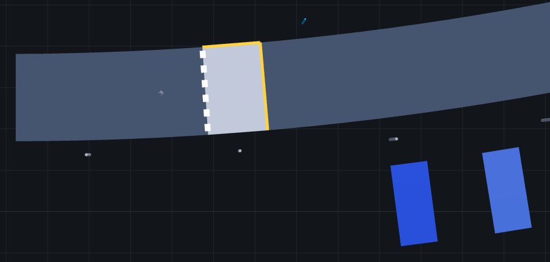
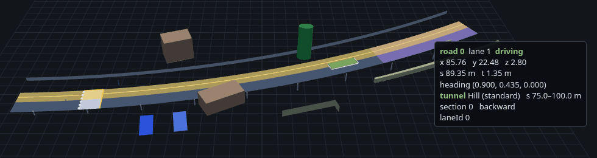

# OpenDRIVE viewer

A three.js page that draws a map baked by `libopendrive`. Hover a lane, an
object, a tunnel or a bridge to read what the crate knows about it.

The viewer has two parts. `examples/viewer_export.rs` bakes an `.xodr` into
JSON, and `web/index.html` draws that JSON. The crate itself does no
rendering.


## Run it

1. Bake a map to JSON. With no second argument, this writes
   `viewer/web/scene.json`.

   ```sh
   cargo run --example viewer_export --features serde -- tests/data/town07.xodr
   ```

2. Serve the folder. The page loads the JSON with `fetch()`, which needs
   HTTP, so opening `index.html` as a file won't work.

   ```sh
   cd viewer/web && python3 -m http.server 8000
   ```

3. Open <http://localhost:8000>.

To keep several maps side by side, give each its own file and name it in the
URL:

```sh
cargo run --example viewer_export --features serde -- tests/data/objects.xodr viewer/web/objects.json
```

Then open <http://localhost:8000/?scene=objects.json>. `objects.xodr` is a
small test map with one of everything the viewer draws, so use it to try the
features below.

## Controls

| Input | Action |
| --- | --- |
| drag | orbit |
| right-drag | pan |
| scroll | zoom |
| `w` | cycle the wireframe |
| `n` | toggle normals |
| `o` | toggle objects |
| click a sidebar entry | highlight it and move the camera to it |
| type in the filter box | filter lanes by road id, lane id or lane type, and tunnels and bridges by name, kind or road |

The checkboxes along the top toggle centerlines (green), lane boundaries
(cream), normals (a hair at every mesh vertex), objects, tunnels and bridges.

## Lanes

Hover a lane to highlight its lane section. The readout shows:

- the road id, the OpenDRIVE lane id and the lane type
- the surface point `x, y, z`, and `s` and `t` along the lane
- the lane's heading
- the crate's internal `LaneId`
- the surface normal, if normals are on

The surface is coloured by lane type, and the legend lists the types in this
map. A lane type the page has no colour for is magenta, so it stands out
instead of passing for a driving lane.

## Objects

Each object is drawn where the crate places it, coloured by type. A solid
with a size is a box or a cylinder, and one with no size is a small diamond.
Outlines and sweeps, such as buildings and guard rails, come from the crate's
`object_mesh()`, so a hole in an outline shows as a gap. An object type the
page has no colour for is cyan.

Hover an object to outline it and light up the lanes it applies to. The
readout shows:

- its type, subtype and name
- its road, OpenDRIVE id, `s`, `t`, orientation and valid length
- the lanes it applies to, by lane section and OpenDRIVE lane id
- its parking access and restrictions, materials, `<userData>` pairs and
  border types, if it has them
- for a solid, its position, heading, pitch, roll and size
- for an outline or a sweep, the point under the cursor and how many corners
  or sections it has, and how many holes an outline has


An object placed by an `<objectReference>` draws the same as the original.
Its readout adds the road and id of the original.

Parking spaces are coloured by who may park there, their `access`, and have
their own legend group.

Markings are painted over the outline in their own colour, cut into dashes
where the map dashes them. Hovering paint picks the object under it. In the
picture below, the crosswalk has a dashed white marking on one edge and a
solid yellow one on the other. The two blue boxes are parking spaces.



Borders, such as a kerb, are bands along the outline, coloured by type.
Hover one for its type and width.

## Tunnels and bridges

The viewer tints the part of each lane a tunnel or bridge covers, purple for
tunnels and cyan for bridges. Hover a tinted lane to add the tunnel's or
bridge's name, type and `s` range to the readout.



The sidebar lists tunnels and bridges above the lanes. Click one to
highlight its lanes and frame the stretch it covers.

## Coordinates

The frame is OpenDRIVE's own: right-handed, Z-up, metres. The camera's up
axis is +Z, so a coordinate on screen is the coordinate in the file.

The heading is the lane's stored geometry direction at the hovered point,
not its travel direction. On a `backward` lane the two are opposite. The page
interpolates the exported tangents the way `Polyline::pose_at` does, so it
agrees with the crate at every vertex and at both ends.

The normal is the baked up-normal interpolated across the hit triangle, the
value `Mesh::height_at` reports. It varies smoothly across facet edges
instead of jumping at each one.

`s` and `t` are measured from the lane centerline, as `Polyline::project`
measures them. `s` is arc length along the lane. `t` is the signed sideways
offset, positive to the left of the lane's stored heading. This is not
OpenDRIVE's road-reference `t`. The baked network has no reference line, so
`t` here is near zero in the middle of a lane.

## How a hover finds its lane

`surface_mesh()` merges every lane into one buffer and records a `LaneSpan`
per lane, the slice of indices that lane owns. Sidewalks and medians get a
span too, so every lane is pickable. A raycast returns a triangle, and the
page binary-searches the spans for the one containing it. That span names
the lane. `load_*_with_provenance` supplies the road id, section and
OpenDRIVE lane id for each `LaneId`.

## Where the lane boundaries come from

The page builds them from the mesh it already has, not from the exporter. A
`LaneSpan`'s vertices alternate between the left and right edge, one pair per
cross-section. The even vertices trace the left boundary and the odd ones
the right. Exporting the same lines again would double the lane data for
nothing.
