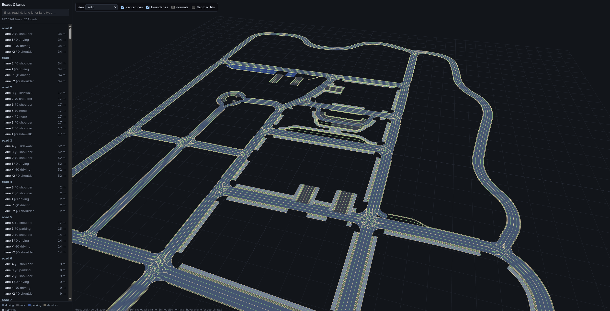

# OpenDRIVE viewer

A three.js viewer for a map baked by `libopendrive`. Hover a lane or an object
to read its coordinates, browse roads and lanes in the sidebar, and filter them
by id.

It has two parts: a Rust exporter (`examples/viewer_export.rs`) that bakes an
`.xodr` into `web/scene.json`, and a static page (`web/index.html`) that renders
it. The page is the only consumer of the crate's output; the crate itself does
no rendering.



## Run it

```sh
# 1. Bake a map to JSON (writes web/scene.json by default).
cargo run --example viewer_export --features serde -- tests/data/town07.xodr

# 2. Serve the folder and open it. fetch() needs HTTP, not file://.
cd viewer/web && python3 -m http.server 8000
# then open http://localhost:8000
```

Load a different scene without renaming it: `?scene=e6mini.json`.
`tests/data/objects.xodr` is a small map that shows every kind of object the
viewer draws, and on its second road, objects placed by reference.

## What you get

- **Hover** highlights the lane section under the cursor and shows a readout of
  `road id`, OpenDRIVE `lane id`, lane type, the surface point `x, y, z`, `s`
  and `t`, the lane heading, and the crate's internal `LaneId`. With
  **normals** on it also reports the surface normal there.
- **Overlays**, each its own toggle: lane **centerlines** in green, lane
  **boundaries** in cream, and **normals** as a hair at every mesh vertex.
  `[n]` toggles normals, `[w]` cycles the wireframe.
- **Objects** drawn where the crate places them, coloured by type: a box or a
  cylinder when the map gives the object a size, and a small diamond marker
  when it does not. Outlines and sweeps, such as buildings and guard rails,
  are drawn from the crate's `object_mesh()`. Hover an object for its type,
  subtype and name, its road, OpenDRIVE id, `s` and `t`, orientation, and
  valid length. The lanes it applies to light up, and the readout lists
  them by lane section and OpenDRIVE lane id. An object an `<objectReference>` placed draws the same as the
  one it points to, and its readout names the road and id of the original. A
  solid adds its position, heading, pitch, roll, and size.
  An outline or a sweep adds the point under the cursor and its corner or
  section count. `[o]` toggles them.
- **Lane-type colour** on the surface itself, with a legend of the types this
  map contains, and of the object types beside it. A lane type the crate knows
  but this page has no colour for shows up magenta, so it is obvious rather
  than silently drawn as a driving lane. An unknown object type is cyan.
- **Sidebar** lists every baked lane grouped by road, with its type. Click one
  to highlight and frame it.
- **Search** filters the list by road id, lane id, or lane type.

## Coordinates

The frame is OpenDRIVE's own: right-handed, **Z-up**, metres. The camera's up
axis is +Z, so a coordinate on screen is the coordinate in the file.

The heading is the lane's stored geometry direction at the hovered station, not
its travel direction; on a `backward` lane the two are opposite. It is the
exported per-vertex tangents interpolated the way `Polyline::pose_at`
interpolates them, so it agrees with the crate at a vertex and at the ends,
where the tangent is the curve's own rather than the last chord's.

The normal is the baked up-normal interpolated across the hit triangle, which
is what `Mesh::height_at` reports. It is smooth across facet edges rather than
stepping at each one.

`s` and `t` are measured against the **lane centerline**, matching
`Polyline::project`: `s` is arc length along the lane, `t` is signed lateral
offset, positive to the left of the lane's stored heading. This is not the
OpenDRIVE road-reference `t`; the baked network is lane-centric and does not
carry the reference line, so `t` here is offset from the lane, near zero at its
middle.

## How a hover resolves to a lane

`surface_mesh()` merges every lane into one buffer and records a `LaneSpan` per
lane: the slice of indices that lane owns. Every lane, not only the drivable
ones, so a sidewalk or a median is pickable too.
 A raycast returns a triangle; the
viewer binary-searches the spans for the one whose index range contains it, and
that names the lane. `load_*_with_provenance` supplies the road id, section, and
original OpenDRIVE lane id for each `LaneId`.

## Where the lane boundaries come from

Not from the exporter. A `LaneSpan`'s vertex range alternates left rib and
right rib, one pair per cross-section, so the even vertices of the range are
the lane's left boundary and the odd ones its right. The page walks the buffer
it already uploaded. Exporting the same polylines a second time would double
the lane table for nothing.
