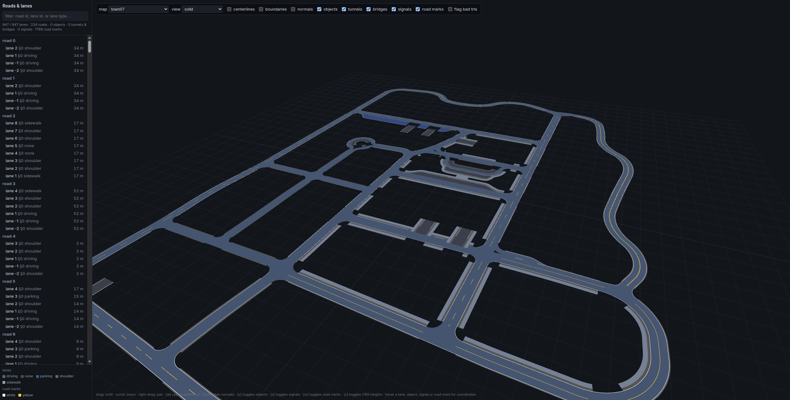
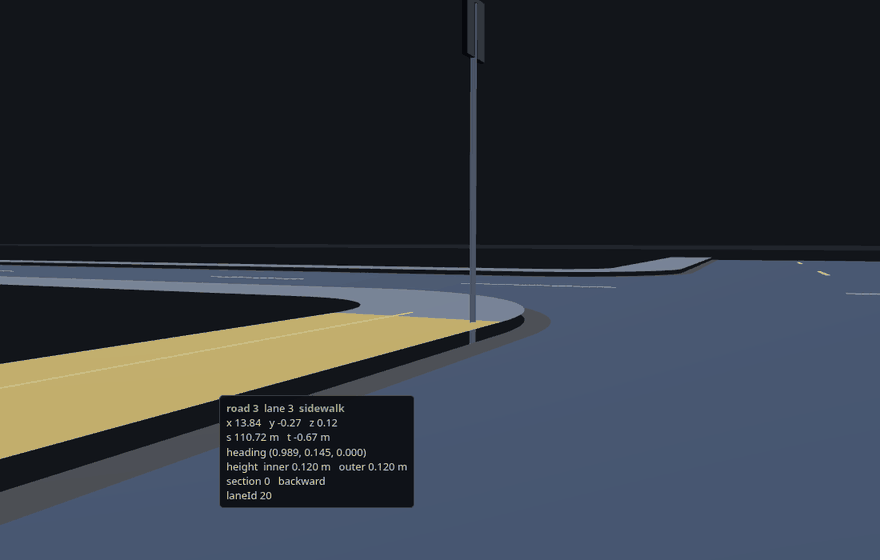
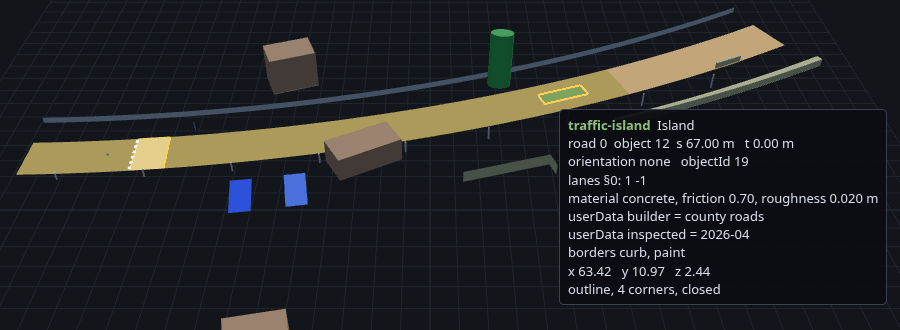
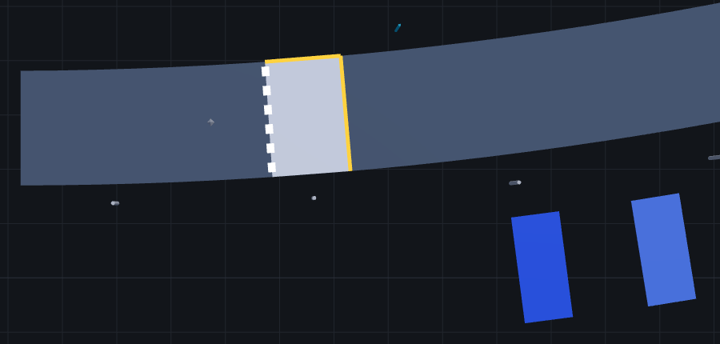
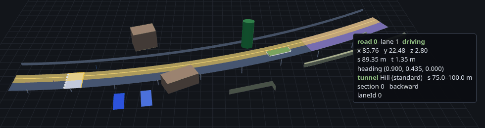
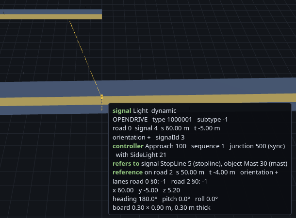
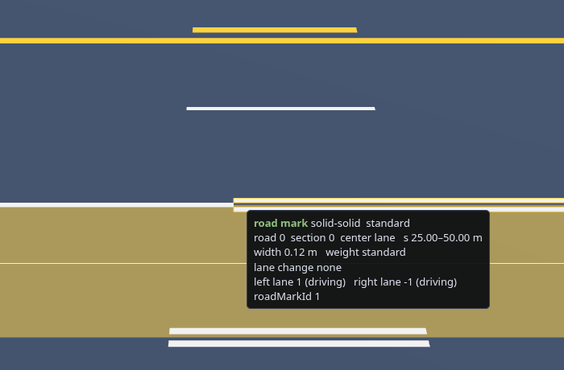
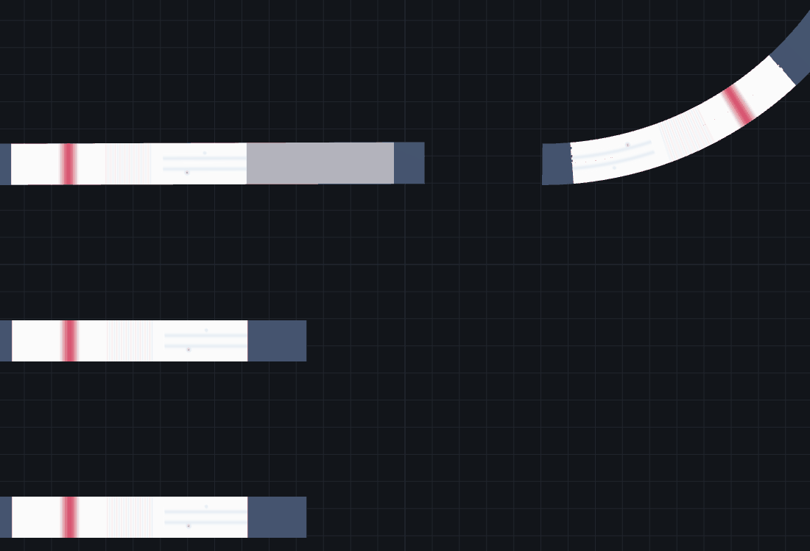
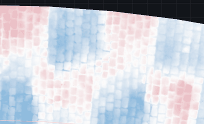

# OpenDRIVE viewer

A three.js page that draws maps baked by `xodr`. Hover anything it
draws, such as a lane, an object, a signal or a junction, to read what
`xodr` knows about it.

`xodr` draws nothing itself. The `xodr-viewer` crate in this
folder is the baker. It turns a `.xodr` map into JSON, and
`web/index.html` draws that JSON.
The page runs `xodr-viewer` in the browser, compiled to WebAssembly,
so it opens a `.xodr` straight from disk. The `viewer_export` binary bakes
the same JSON ahead of time, for maps you want in the page's `map` list.



## Run it

1. Start the viewer:

   ```sh
   sh viewer/run.sh
   ```

   The script builds the WebAssembly baker into `viewer/web/pkg/`, bakes
   again every map in the `map` list that an older viewer wrote, serves
   `viewer/web` on <http://localhost:8000> and opens that page in your
   browser. To use another port, give it as `sh viewer/run.sh 8080`. Press
   Ctrl-C to stop the server.

   The first run also installs the `wasm32-unknown-unknown` target and the
   matching `wasm-bindgen` CLI.

2. Click `open .xodr` in the toolbar and pick a map. Where the map lays
   OpenCRG files on its roads, pick them in the same dialog. The page
   matches them by file name, and lists any it lacks in the sidebar's
   warnings.

To host the page somewhere else, run `sh viewer/build.sh` and serve
`viewer/web` with any static file server. Browsers load ES modules and
WebAssembly only over HTTP, so opening `index.html` as a file won't work.

The page keeps the files you opened in the browser's IndexedDB, so a reload
draws the same map. The URL names it, as `?open=town07.xodr`, but only this
browser has the file, so the link won't work anywhere else.

A map that fails to import shows the crate's error in place of the map.

### Baked maps

To bake a map is to turn its `.xodr` into the JSON the page draws, a scene.
The page bakes a map you open. `viewer_export` bakes maps ahead of time, to
`viewer/web/`, each named after its map, and lists them in
`viewer/web/scenes.json`. The `map` list offers every one. Name as many
maps as you like, such as `tests/data/*.xodr`:

```sh
cargo run --release -p xodr-viewer -- tests/data/town07.xodr
```

The URL names a baked map as `?scene=town07.json`, so a link opens the same
one. To bake to another path, give one map and the output:

```sh
cargo run --release -p xodr-viewer -- tests/data/objects.xodr /tmp/objects.json
```

`viewer_export` reads OpenCRG files from beside the `.xodr`. If a map fails
to load, `viewer_export` reports it, bakes the others, and exits with an
error.

A scene holds what the viewer that baked it knew, so it goes out of date
when the crate or the viewer changes. `viewer_export` records the `.xodr`
each scene came from in `viewer/web/sources.json`. `sh viewer/build.sh`,
which `run.sh` runs, then calls `viewer_export --refresh`. That bakes again
every scene older than its `.xodr` or than `viewer_export` itself. A scene
with no recorded source is looked for as `tests/data/<name>.xodr`. The
refresh names any scene it can't find a source for and leaves it as it is.
Export it once by hand, and later refreshes find it.

`tests/data/objects.xodr` is a small test map with one of everything the
viewer draws, so use it to try the features below.

## Controls

| Input | Action |
| --- | --- |
| drag | orbit |
| right-drag | pan |
| scroll | zoom |
| `w` | cycle the wireframe |
| `n` | toggle normals |
| `o` | toggle objects |
| `s` | toggle signals |
| `m` | toggle road marks |
| `c` | toggle the CRG heat map |
| `open .xodr` | open a map, with any `.crg` files it uses |
| pick in the `map` list | load a baked map |
| click a sidebar entry | select it and move the camera to it, or clear it if selected |
| click a lane | drop a marker there |
| `f` / `b` | step the marker 5 m along the lanes, or back |
| `Esc` | clear the marker |
| type in the filter box | filter lanes by road id, lane id or lane type, objects by type, subtype, name or id, signals by name, country, type, subtype or id, tunnels and bridges by name, kind or road, and warnings by their text |

The `view` list draws the road solid, as a wireframe, or both. The
checkboxes along the top toggle centerlines (green), lane boundaries
(cream), normals (a hair at every mesh vertex), objects, tunnels, bridges,
junctions, signals, road marks and the CRG heat map. `flag bad tris` paints
every inverted or near-zero-area triangle of the road mesh red, and counts
them.

## Sidebar

The sidebar lists each road with its lanes, objects and signals, and the
tunnels and bridges above them. A group of 12 or fewer starts open. So on a
small map everything is listed, and on town07 you see 234 closed roads.
Filtering opens every group that matches.

At the top, in amber, are the map's warnings. Most are what `xodr`
dropped from a bad file, such as a road with no geometry or a lane with no
`<width>`. The rest come from the baker: a CRG file it could not load, or a
mesh that is not a valid triangle mesh. Click a warning to light the lanes of the
road it names and frame them. A skipped road has no lanes, so the readout
says so instead. A clean map has no warnings group.

Click an object or a signal to select it. The camera frames it, and the
readout opens beside it. It stays outlined, with its lanes lit and a
signal's dashed lines drawn, while you hover other things. Click it again
to clear it.

Under the map's name, the sidebar shows its `<geoReference>` PROJ string
and `<offset>` as the file gives them. A map without either shows neither.

## Lanes

Hover a lane to highlight its lane section. A white arrow on its centerline
points the way traffic drives, so on a `backward` lane the arrow runs
against the heading below. On a lane whose `direction` is `both`, the arrow
points both ways. On a left-hand-traffic road the left lanes are the
`forward` ones. The hovered lane's successors are green and its
predecessors orange. While a lane is selected in the sidebar, its own links
stay lit as you hover others. The readout shows:

- the road id, the OpenDRIVE lane id and the lane type
- the surface point `x, y, z`
- the road `s` and `t` there, in OpenDRIVE's road coordinates
- the lane position: the offset from the lane's center toward `+t`, and how
  far along the lane's centerline the point is
- the lane's width at that point, which grows along a lane that opens out
  of nothing, whether its widths or its `<border>`s shape it. On a tilted
  lane, the page measures the width across the lane's surface.
- the lane's heading
- its cross slope at that point, in percent up or down toward +t, from
  superelevation, lateral shape and lane heights together
- on a lane raised by its `<height>`s, such as a sidewalk, how far it stands
  off the road at its inner and outer border at that point
- the speed limit at that point, in km/h and mph, or `none` for no limit,
  and the road type, where the map gives them
- the junction the lane's road is part of, and the group it is in, such as
  a roundabout, where the map groups junctions
- which roads the lane's road gives way to in its junction, and which give
  way to it, where the map gives junction priorities
- the cross paths a crossing road's lane carries, from which lane and `s`
  to which, or on a lane a cross path joins, where it joins and the lane it
  crosses on
- the roads the lane's road names beside it, on which side and which way
  they run, where the map gives `<neighbor>`s
- whether the road mark on each side lets a vehicle change into the lane
  beside, left and right of the traffic, or `n/a` where there is no mark or
  no lane. A scene an older viewer baked says to run `viewer/run.sh`,
  which bakes it again.
- the lane's rule, who may use it (`only` the users an allow names, or
  `all but` those a deny names) and its material, where the map gives them
- how far a driver can see from the lane, forward, back, left and right,
  where the map gives its `<visibility>`
- its successors and predecessors, by road, lane section and OpenDRIVE
  lane id
- the crate's internal `LaneId`
- the surface normal, if normals are on

The surface is coloured by lane type, and the legend lists the types in this
map. A lane type the page has no colour for is magenta, so it stands out
instead of passing for a driving lane.

A raised sidewalk stands above the road beside it, with the step up to it
left open. Here, in esmini's `fabriksgatan_traffic_lights.xodr`, the
sidewalk is 0.12 m up and the traffic light stands on it.



## Moving along the lanes

Click a lane to drop a marker on it, and press `f` to step it 5 m along the
lanes the way their traffic runs, or `b` to step it back. At a fork it
splits, one blue square per branch, and a branch that runs out of lanes
turns red at the lane's end. The box at the top right lists each branch:
its road, lane, lane section and centerline `s`.

The page steps the marker as `RoadNetwork::advance` does, along the lanes'
centerlines and onto each successor or predecessor, from the lane lengths,
directions and links the baker writes. It keeps the marker's offset to
the left of the traffic. On a lane whose `direction` is `both`, the marker
splits and steps each way.

## Objects

Each object is drawn where the crate places it, coloured by type. Anything
with an area comes from the crate's `object_mesh()`: boxes, cylinders,
outlines and sweeps. So a hole in an outline shows as a gap. The mesh leaves
out a post given only a height, which is drawn as a thin post, and a solid
with no size, which is a small diamond. An object type the page has no
colour for is cyan.

Hover an object to outline it and light up the lanes it applies to. The
readout shows:

- its type, subtype and name
- its road, OpenDRIVE id, `s`, `t`, orientation and valid length
- the lanes it applies to, by lane section and OpenDRIVE lane id
- its parking access and restrictions, materials, `<userData>` pairs,
  markings and border types, if it has them
- for a solid, its position, heading, pitch, roll and size
- for an outline or a sweep, the point under the cursor and how many corners
  or sections it has, how many holes an outline has, and whether a sweep is
  round



An object placed by an `<objectReference>` draws the same as the original.
Its readout adds the road and id of the original.

Parking spaces are coloured by who may park there, their `access`, and have
their own legend group.

Markings are painted over the outline in their own colour, cut into dashes
where the map dashes them. Hovering paint picks the object under it. In the
picture below, the crosswalk has a dashed white marking on one edge and a
solid yellow one on the other. The two blue boxes are parking spaces.



Borders, such as a kerb, are bands along the outline, coloured by type.
Hover one for its type and width. Where two borders share an edge, the one
later in the file is drawn over the other.

## Tunnels and bridges

The viewer tints the part of each lane a tunnel or bridge covers, purple for
tunnels and cyan for bridges. Hover a tinted lane to add the tunnel's or
bridge's name, type and `s` range to the readout.



The sidebar lists tunnels and bridges above the lanes. Click one to
highlight its lanes and frame the stretch it covers.

## Junctions

Where a junction gives a `<boundary>` or an `<elevationGrid>`, the viewer
draws its ground in grey under the roads, and its boundary in amber. The
ground comes from `JunctionArea::mesh`, at the grid's height, so the
gaps between a junction's connecting roads are filled. Hover the ground to
read its junction, the point and its height. The `junctions` checkbox
hides both.

The crate does not move the junction's roads onto the grid, so where a
file's roads and grid disagree, the ground shows above or below the roads.

## Virtual junctions

A virtual junction's stretch of its main road is drawn as a cyan tube along
the road, and each place one of its roads meets another part way along as a
pink tube from one side to the other. Hover one to read the junction's main
road, stretch and orientation, and a link's sides and the lanes it joins.
They show and hide with the `junctions` checkbox.

## Railways

Each station platform is drawn as a grey strip beside its track, and each
railway switch as a red post where it leaves the main track. Hover one to
read its station and stretch of track, or its tracks, setting and partner.
They show and hide with the `objects` checkbox.

## Signals

Each signal is a board of its `width` and `height`, standing on the middle
of its bottom edge. Its front, the face turned to the traffic it addresses,
is drawn flat in the board's colour, and its back and sides are grey. A
static sign is white and a dynamic signal, such as a traffic light, is a
dark box. A board the map gives no size is 0.6 m square. There is no post,
since the map doesn't say how a signal is mounted. A pole is a separate
`<object>` when the map has one.

Hover a signal to outline it, light up the lanes it applies to, and draw a
dashed line from the board to the road where it takes effect. That is
straight down, unless the map stands the board somewhere else with a
`<positionRoad>` or `<positionInertial>`, such as on a gantry or beside
another road. Then the line runs across to where it applies. A
`<signalReference>` applies the signal on another road too. Its lanes light
up with the rest, and another dashed line runs to it. The readout shows:

- its name, and whether it is dynamic, invalidated or temporary
- what it means, from its `<semantics>`, such as `maximum speed 50 km/h;
  except bus`
- each board it is: a static board's signs, with what each shows and means,
  or a message board's display and its display areas
- its country, `type` and `subtype`, as the map spells them
- its value and unit, and its text
- its road, OpenDRIVE id, `s`, `t` and orientation
- each controller it belongs to, with its priority, the junctions that sync
  it, and the other signals it switches together with this one
- the signals it depends on, and the signals and objects it refers to, by
  name, OpenDRIVE id and link type
- the road, `s`, `t` and orientation of each `<signalReference>`
- the lanes it applies to, by road where there are several, lane section
  and OpenDRIVE lane id
- where it applies, if the board stands somewhere else
- the board's position, heading, pitch, roll and size



`tests/data/signals.xodr` has signs and lights with every feature the viewer
draws. Open it to try them.

## Road marks

Each road mark's lines are painted on the road in their colour, cut into
dashes where the crate dashes them, and moved sideways where the mark
sways. A mark that isn't paint, such as a kerb, or a mark of type `none`,
draws nothing. The legend lists the colours in
this map. A colour the page doesn't know is magenta.

Hover a line to outline its mark and light up the lanes either side of it.
The readout shows:

- its type and colour
- its road, lane section, and the OpenDRIVE lane whose border it runs
  along, or the center lane
- the stretch of road it covers, as `s` along the reference line
- its width, weight and height
- which way traffic may cross it
- the lanes on its left and right, looking along the road's `+s`, or the
  road edge where there is none
- each of its lines: continuous, its dash and gap lengths, or its length
  if it paints once, how far along the mark it starts and how far off the
  border it sits if not 0, its width and colour, and its rule unless that
  is `none`



`tests/data/road_marks.xodr` has every road mark type on one road, a road
of `<type><line>` marks, and a road with `<explicit>` lines and a sway.
Open it to try them.

## OpenCRG surfaces

Where the map lays OpenCRG files on its roads, the page loads the ones you
opened with the map, and `viewer_export` loads the ones beside the `.xodr`.
The sidebar's warnings name any file that did not load. The baker samples
`RoadSurface` over every lane a CRG covers, and the page draws the result
as a heat map over the road. The colour is the CRG grid's own height, times
`zScale`, without the file's reference-line height or bank. White is the
median of those heights, blue is below it and red above. The scale saturates
at the 99.9th percentile of the distance from the median, and the legend
shows its ends. Grey is where only a friction CRG covers the road.

The viewer drapes the heat map 5 mm above the road mesh, so the road never
hides it. Its shape is the road mesh's, not the CRG surface's. Hover it to
read the CRG height, the surface height `z` and the friction under the
cursor, and the CRG files on the lane.

The grid is as fine as the finest CRG file, or coarser to keep to about
250,000 cells per file.

`tests/data/crg.xodr` lays the same generated file on four roads, one per
mode, and a friction file on the first. Open it with `crg_bumps.crg` and
`crg_grip.crg`, which sit beside it.



For measured surfaces, `examples/crg_data.sh` downloads five CRG files, writes
a map for each, and exports it to `viewer/web/NAME.json`. The scenes are 12
to 38 MB each. Pick `belgian_block` for a scan of cobbles, or `country_road`
for 569 m of a country road.

```sh
sh examples/crg_data.sh
```



## Coordinates

The frame is OpenDRIVE's own: right-handed, Z-up, metres. The camera's up
axis is +Z, so a coordinate on screen is the coordinate in the file.

The heading is the lane's stored geometry direction at the hovered point,
not its travel direction. On a `backward` lane the two are opposite. The page
interpolates the exported tangents the way `Polyline::pose_at` does, so it
agrees with the crate at every vertex and at both ends.

The normal is the baked up-normal interpolated across the hit triangle, the
value `Mesh::height_at` reports. It varies smoothly across facet edges
instead of jumping at each one.

The road `s` and `t` are OpenDRIVE's own: `s` along the road's reference
line and `t` across it, positive to the left. The baker gives each
centerline vertex its road `s` and `t` from `RoadNetwork::road_position_on`,
on the lane's own road. The page interpolates them along the lane, and adds
the hovered point's offset from the centerline, tilted with the lane.

A lane position shares the road's `s`. Its offset is from the lane's
center toward `+t`, as `RoadNetwork::lane_position` gives it, so it is near
zero in the middle of a lane. The centerline `s` is the distance along the
lane's baked centerline, as `Polyline::project` measures it and
`RoadNetwork::centerline_s` gives it. The speed limits and other stretches
along a lane use it. On a bend it drifts away from the road's `s`.

## How a hover finds its lane

`surface_mesh()` merges every lane into one buffer and records a `LaneSpan`
per lane, the slice of indices that lane owns. Sidewalks and medians get a
span too, so every lane is pickable. A raycast returns a triangle, and the
page binary-searches the spans for the one containing it. That span names
the lane. `load_*_with_provenance` supplies the road id, section and
OpenDRIVE lane id for each `LaneId`.

## Where the lane boundaries come from

The page builds them from the mesh it already has, not from the baker. A
`LaneSpan`'s vertices alternate between the left and right edge, one pair per
cross-section. The even vertices trace the left boundary and the odd ones
the right. Exporting the same lines again would double the lane data for
nothing.
